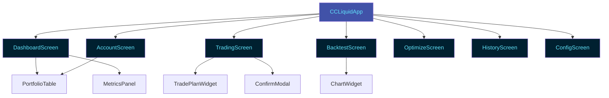

# Terminal User Interface (TUI)

The cc-flow TUI provides a full-featured terminal interface for managing your Hyperliquid portfolio. Built with [Textual](https://textual.textualize.io/), it offers a modern, brutalist-designed interface for real-time monitoring, trading, backtesting, and configuration management.

## Quick Start

Launch the TUI with:

```bash
uv run python -m cc_flow.ui
```

## Design Philosophy

The cc-flow TUI follows a **brutalist/minimalist design philosophy**:

- **High-contrast colors**: Cyan (`#62e4fb`), deep purple (`#4152A8`), dark abyss (`#001926`)
- **Stark, functional interfaces**: No unnecessary decoration
- **Edward Tufte-inspired**: High information density, data-ink ratio optimization
- **Geometric patterns**: Clean tables, panels, and grids

## Navigation

The TUI uses single-key navigation for quick access to all screens:

| Key | Screen | Description |
|-----|--------|-------------|
| `d` | Dashboard | Real-time portfolio monitoring with auto-refresh |
| `t` | Trading | Manual rebalancing with trade plan preview |
| `a` | Account | Detailed account metrics and positions |
| `b` | Backtest | Strategy backtesting with historical data |
| `o` | Optimize | Grid search for optimal parameters |
| `h` | History | Trade history and performance analysis |
| `c` | Config | Configuration viewing and editing |
| `q` | Quit | Exit the application |

## Available Screens

### Dashboard (`d`)
Live portfolio monitoring with:
- Account summary (value, PnL, leverage)
- Open positions table with real-time prices
- Next rebalance countdown
- Auto-refresh every 2 seconds

### Trading (`t`)
Manual rebalancing workflow:
1. Click "Plan Rebalance" to generate trade plan
2. Review trades in detailed table
3. Click "Execute Plan" to confirm and execute
4. View execution results

### Account (`a`)
Comprehensive account view:
- Detailed account metrics
- Margin breakdown with percentages
- Extended positions table with liquidation prices
- Manual refresh capability

### Backtest (`b`)
Strategy backtesting:
- Configure backtest parameters
- Run simulations on historical data
- View performance and risk metrics
- Visualize equity curves

### Optimize (`o`)
Parameter optimization:
- Define parameter ranges
- Run parallel grid search
- Compare results by different metrics
- Export optimal configurations

### History (`h`)
Trade history analysis:
- Filter by date range
- View all historical trades
- Performance summaries
- Export capabilities

### Config (`c`)
Configuration management:
- View current settings
- Edit configuration values
- Profile management
- Validation and save

## Key Components

### Widgets

Reusable UI components:

- **[PortfolioTable](widgets.md#portfoliotable)**: Displays positions with color-coded PnL
- **[MetricsPanel](widgets.md#metricspanel)**: Key performance metrics display
- **[OrderBookWidget](widgets.md#orderbookwidget)**: Real-time market depth
- **[TradePlanWidget](widgets.md#tradeplanwidget)**: Trade plan preview with summary
- **[ChartWidget](widgets.md#chartwidget)**: ASCII sparkline charts
- **[Modals](widgets.md#modals)**: Confirmation, error, info, and input dialogs

### Screens

Full-screen views implementing specific workflows. See the [Screens Development Guide](screens.md) for details on creating custom screens.

## Architecture Overview



## Core Integration

The TUI integrates with cc-flow's core components:

- **TradingOrchestrator**: Coordinates trading operations
- **Exchange**: Hyperliquid API client for market data and execution
- **DataSource**: Prediction data loading (CrowdCent/Numerai)
- **TradingConfig**: Configuration management

```python
from cc_flow.ui.app import CCLiquidApp

# Initialize with core services
app = CCLiquidApp(
    exchange=exchange,
    data_source=data_source,
    config=config
)

# Run the app
app.run()
```

## Styling

All styles are defined in `cc_flow/ui/styles/main.tcss` using Textual CSS. The brutalist theme includes:

- Dark backgrounds with high contrast
- Color-coded status (green=success, red=error, yellow=warning, cyan=info)
- Zebra-striped tables for readability
- Bold section titles and headers
- Responsive grid layouts

## Development

### Adding a New Widget

1. Create widget file in `cc_flow/ui/widgets/`
2. Inherit from appropriate Textual widget
3. Implement `compose()` and update methods
4. Add CSS styles to `main.tcss`
5. Document in [widgets.md](widgets.md)

### Adding a New Screen

1. Create screen file in `cc_flow/ui/screens/`
2. Inherit from `Screen`
3. Implement `compose()` and event handlers
4. Add navigation binding to `CCLiquidApp`
5. Document in [screens.md](screens.md)

See the full guides for detailed examples and best practices.

## Testing

TUI components are tested using Textual's testing framework:

```python
from textual.app import App
from cc_flow.ui.widgets.portfolio_table import PortfolioTable

async def test_portfolio_table():
    app = App()
    async with app.run_test():
        table = PortfolioTable()
        await table.update_positions(positions)
        assert len(table.rows) == len(positions)
```

## Performance

The TUI is optimized for performance:

- **Auto-refresh**: Dashboard updates every 2 seconds
- **Worker decorator**: Async operations don't block UI
- **Lazy loading**: Data fetched on-demand
- **Efficient updates**: Only changed elements are re-rendered

## Troubleshooting

### TUI won't start

Check that all dependencies are installed:
```bash
uv sync
```

### Terminal rendering issues

Ensure your terminal supports:
- True color (24-bit)
- UTF-8 encoding
- Modern terminal emulator (iTerm2, Windows Terminal, etc.)

### Key bindings not working

Some terminals may capture certain key combinations. Check your terminal settings or use alternative navigation.

## Further Reading

- [Widgets Usage Guide](widgets.md) - Detailed widget documentation
- [Screens Development Guide](screens.md) - Creating custom screens
- [API Reference](api-reference.md) - Complete API documentation
- [Textual Documentation](https://textual.textualize.io/) - Textual framework docs
