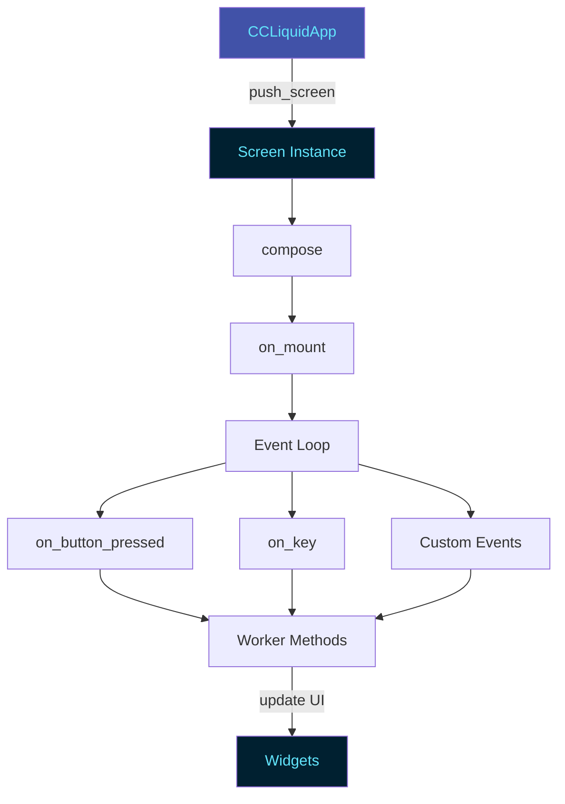

# Screens Development Guide

This guide teaches you how to create custom screens for the cc-flow TUI, covering screen lifecycle, event handling, integration with widgets, and best practices.

## Overview

Screens are full-screen views in the TUI that implement specific workflows. Each screen inherits from Textual's `Screen` class and handles its own layout, state, and events.

## Screen Architecture



## Screen Lifecycle

1. **Initialization**: `__init__()` - Set up initial state
2. **Composition**: `compose()` - Create widget tree
3. **Mounting**: `on_mount()` - Set up after widgets exist
4. **Event Handling**: Respond to user interactions
5. **Cleanup**: Automatic when screen is popped

## Basic Screen Template

```python
"""My custom screen module.

Description of what this screen does and its purpose.
"""

from __future__ import annotations

from typing import TYPE_CHECKING

from textual import work
from textual.app import ComposeResult
from textual.containers import Container, Vertical
from textual.screen import Screen
from textual.widgets import Button, Static

if TYPE_CHECKING:
    from cc_flow.core.trader import TradingOrchestrator


class MyCustomScreen(Screen):
    """Custom screen for specific workflow.

    Description of the screen's functionality and workflow.

    Attributes:
        orchestrator: TradingOrchestrator instance for trading operations
        current_data: State data for the screen

    Example:
        >>> screen = MyCustomScreen(orchestrator)
        >>> app.push_screen(screen)
    """

    def __init__(
        self,
        orchestrator: TradingOrchestrator,
        **kwargs,
    ) -> None:
        """Initialize custom screen.

        Args:
            orchestrator: TradingOrchestrator instance
            **kwargs: Additional screen arguments
        """
        super().__init__(**kwargs)
        self.orchestrator = orchestrator
        self.current_data = None

    def compose(self) -> ComposeResult:
        """Create screen layout.

        Yields:
            Container with widgets for this screen
        """
        with Container(id="my-screen"):
            with Vertical(classes="panel"):
                yield Static("My Screen Title", classes="section-title")
                yield Static("Initial content", id="content")
                yield Button("Action", id="btn-action", variant="primary")

    def on_mount(self) -> None:
        """Called when screen is mounted.

        Set up initial state and load data.
        """
        # Initialize components
        self.load_initial_data()

    def on_button_pressed(self, event: Button.Pressed) -> None:
        """Handle button clicks.

        Args:
            event: Button press event
        """
        if event.button.id == "btn-action":
            self.perform_action()

    @work(exclusive=True)
    async def perform_action(self) -> None:
        """Perform async action (worker wrapper)."""
        await self._perform_action_internal()

    async def _perform_action_internal(self) -> None:
        """Internal action implementation."""
        from cc_flow.utils.logger_config import log

        try:
            # Perform async operation
            result = await self.orchestrator.some_operation()

            # Update UI
            content = self.query_one("#content", Static)
            content.update(f"Result: {result}")

        except Exception as e:
            log.error(f"Action failed: {e}")
            content = self.query_one("#content", Static)
            content.update(f"Error: {e}")

    def load_initial_data(self) -> None:
        """Load initial screen data."""
        # Implementation
        pass
```

## Screen Examples

### Example 1: Simple Display Screen

A read-only screen displaying account information:

```python
from textual.app import ComposeResult
from textual.containers import Container, Vertical
from textual.screen import Screen
from textual.widgets import Button, Static


class AccountInfoScreen(Screen):
    """Display detailed account information."""

    def __init__(self, orchestrator, **kwargs):
        super().__init__(**kwargs)
        self.orchestrator = orchestrator

    def compose(self) -> ComposeResult:
        """Create layout."""
        with Container(id="account-info"):
            yield Button("Refresh", id="btn-refresh", variant="primary")

            with Vertical(classes="panel"):
                yield Static("Account Details", classes="section-title")
                yield Static("Loading...", id="account-details")

    def on_mount(self) -> None:
        """Load initial data."""
        self.refresh_account()

    def on_button_pressed(self, event: Button.Pressed) -> None:
        """Handle refresh button."""
        if event.button.id == "btn-refresh":
            self.refresh_account()

    @work(exclusive=True)
    async def refresh_account(self) -> None:
        """Refresh account data."""
        snapshot = await self.orchestrator._get_current_portfolio()

        details = (
            f"Account Value: ${snapshot.account.account_value:,.2f}\n"
            f"Positions: {len(snapshot.positions)}\n"
            f"PnL: ${snapshot.total_unrealized_pnl:+,.2f}"
        )

        details_widget = self.query_one("#account-details", Static)
        details_widget.update(details)
```

### Example 2: Interactive Form Screen

A screen with user input and validation:

```python
from textual.app import ComposeResult
from textual.containers import Container, Vertical
from textual.screen import Screen
from textual.widgets import Button, Input, Label, Static
from decimal import Decimal


class OrderEntryScreen(Screen):
    """Manual order entry form."""

    def __init__(self, orchestrator, **kwargs):
        super().__init__(**kwargs)
        self.orchestrator = orchestrator

    def compose(self) -> ComposeResult:
        """Create form layout."""
        with Container(id="order-entry"):
            with Vertical(classes="panel"):
                yield Static("Manual Order Entry", classes="section-title")

                yield Label("Symbol:")
                yield Input(id="input-symbol", placeholder="e.g., BTC")

                yield Label("Size:")
                yield Input(id="input-size", placeholder="0.0")

                yield Label("Side:")
                yield Input(id="input-side", placeholder="BUY or SELL")

                yield Button("Submit Order", id="btn-submit", variant="success")
                yield Static("", id="order-status")

    def on_button_pressed(self, event: Button.Pressed) -> None:
        """Handle form submission."""
        if event.button.id == "btn-submit":
            self.submit_order()

    @work(exclusive=True)
    async def submit_order(self) -> None:
        """Validate and submit order."""
        from cc_flow.utils.logger_config import log

        # Get form values
        symbol = self.query_one("#input-symbol", Input).value
        size_str = self.query_one("#input-size", Input).value
        side = self.query_one("#input-side", Input).value.upper()

        status = self.query_one("#order-status", Static)

        # Validate
        if not symbol or not size_str or not side:
            status.update("[red]All fields are required[/red]")
            return

        try:
            size = Decimal(size_str)
        except Exception:
            status.update("[red]Invalid size format[/red]")
            return

        if side not in ("BUY", "SELL"):
            status.update("[red]Side must be BUY or SELL[/red]")
            return

        # Submit order
        try:
            status.update("Submitting order...")
            # await self.orchestrator.submit_manual_order(symbol, side, size)
            status.update(f"[green]Order submitted: {side} {size} {symbol}[/green]")
            log.info(f"Order submitted: {side} {size} {symbol}")
        except Exception as e:
            status.update(f"[red]Order failed: {e}[/red]")
            log.error(f"Order submission failed: {e}")
```

### Example 3: Screen with Widgets

A screen integrating custom widgets:

```python
from textual.app import ComposeResult
from textual.containers import Container, Horizontal, Vertical
from textual.screen import Screen
from textual.widgets import Button, Static

from cc_flow.ui.widgets.portfolio_table import PortfolioTable
from cc_flow.ui.widgets.metrics_panel import MetricsPanel


class PortfolioAnalysisScreen(Screen):
    """Comprehensive portfolio analysis with widgets."""

    def __init__(self, orchestrator, **kwargs):
        super().__init__(**kwargs)
        self.orchestrator = orchestrator

    def compose(self) -> ComposeResult:
        """Create layout with custom widgets."""
        with Container(id="portfolio-analysis"):
            yield Button("Refresh", id="btn-refresh", variant="primary")

            with Horizontal(classes="panel"):
                # Metrics panel on left
                with Vertical():
                    yield Static("Key Metrics", classes="section-title")
                    yield MetricsPanel(id="metrics")

                # Positions table on right
                with Vertical():
                    yield Static("Positions", classes="section-title")
                    yield PortfolioTable(id="positions")

    def on_mount(self) -> None:
        """Load initial data."""
        self.refresh_data()

    def on_button_pressed(self, event: Button.Pressed) -> None:
        """Handle refresh button."""
        if event.button.id == "btn-refresh":
            self.refresh_data()

    @work(exclusive=True)
    async def refresh_data(self) -> None:
        """Refresh all data."""
        snapshot = await self.orchestrator._get_current_portfolio()

        # Update metrics panel
        metrics_panel = self.query_one("#metrics", MetricsPanel)
        metrics = {
            "Account Value": metrics_panel.format_currency(
                snapshot.account.account_value
            ),
            "Total PnL": metrics_panel.format_pnl(
                snapshot.total_unrealized_pnl
            ),
            "Leverage": metrics_panel.format_leverage(
                snapshot.account.current_leverage
            ),
            "Positions": str(len(snapshot.positions)),
        }
        metrics_panel.update_metrics(metrics)

        # Update positions table
        positions_table = self.query_one("#positions", PortfolioTable)
        positions_table.update_positions(snapshot.positions)
```

### Example 4: Screen with Auto-Refresh

A screen with periodic updates:

```python
from textual import work
from textual.app import ComposeResult
from textual.containers import Container, Vertical
from textual.screen import Screen
from textual.widgets import Static


class LiveMonitorScreen(Screen):
    """Live monitoring with auto-refresh."""

    def __init__(self, orchestrator, refresh_interval: float = 2.0, **kwargs):
        super().__init__(**kwargs)
        self.orchestrator = orchestrator
        self.refresh_interval = refresh_interval
        self._timer = None

    def compose(self) -> ComposeResult:
        """Create layout."""
        with Container(id="live-monitor"):
            with Vertical(classes="panel"):
                yield Static("Live Data", classes="section-title")
                yield Static("Loading...", id="live-data")

    def on_mount(self) -> None:
        """Start auto-refresh."""
        # Set up interval timer
        self._timer = self.set_interval(
            self.refresh_interval,
            self.refresh_data
        )

        # Initial load
        self.refresh_data()

    def on_unmount(self) -> None:
        """Stop auto-refresh."""
        if self._timer:
            self._timer.stop()

    @work(exclusive=True)
    async def refresh_data(self) -> None:
        """Refresh live data."""
        from datetime import datetime

        try:
            snapshot = await self.orchestrator._get_current_portfolio()

            # Format data
            data = (
                f"Last Update: {datetime.now().strftime('%H:%M:%S')}\n"
                f"Account Value: ${snapshot.account.account_value:,.2f}\n"
                f"Positions: {len(snapshot.positions)}\n"
                f"PnL: ${snapshot.total_unrealized_pnl:+,.2f}"
            )

            # Update widget
            data_widget = self.query_one("#live-data", Static)
            data_widget.update(data)

        except Exception as e:
            from cc_flow.utils.logger_config import log
            log.error(f"Refresh failed: {e}")
```

### Example 5: Screen with Modal Dialogs

A screen using modals for confirmation:

```python
from textual.app import ComposeResult
from textual.containers import Container, Vertical
from textual.screen import Screen
from textual.widgets import Button, Static

from cc_flow.ui.widgets.modals import ConfirmModal, ErrorModal, InfoModal


class DangerousOperationScreen(Screen):
    """Screen with confirmation dialogs."""

    def __init__(self, orchestrator, **kwargs):
        super().__init__(**kwargs)
        self.orchestrator = orchestrator

    def compose(self) -> ComposeResult:
        """Create layout."""
        with Container(id="dangerous-ops"):
            with Vertical(classes="panel"):
                yield Static("Dangerous Operations", classes="section-title")
                yield Button(
                    "Close All Positions",
                    id="btn-close-all",
                    variant="error"
                )
                yield Static("", id="op-status")

    def on_button_pressed(self, event: Button.Pressed) -> None:
        """Handle button with confirmation."""
        if event.button.id == "btn-close-all":
            self.confirm_close_all()

    async def confirm_close_all(self) -> None:
        """Show confirmation modal."""
        confirmed = await self.app.push_screen_wait(
            ConfirmModal(
                "This will close ALL open positions. Continue?",
                title="Confirm Close All"
            )
        )

        if confirmed:
            await self.perform_close_all()

    async def perform_close_all(self) -> None:
        """Execute close all operation."""
        from cc_flow.utils.logger_config import log

        status = self.query_one("#op-status", Static)
        status.update("Closing all positions...")

        try:
            # Execute operation
            # result = await self.orchestrator.close_all_positions()

            # Show success modal
            await self.app.push_screen_wait(
                InfoModal(
                    "All positions closed successfully",
                    title="Success"
                )
            )

            status.update("[green]All positions closed[/green]")
            log.info("All positions closed")

        except Exception as e:
            # Show error modal
            await self.app.push_screen_wait(
                ErrorModal(
                    "Failed to close positions",
                    details=str(e),
                    title="Error"
                )
            )

            status.update(f"[red]Error: {e}[/red]")
            log.error(f"Close all failed: {e}")
```

## Layout Patterns

### Grid Layout

```python
def compose(self) -> ComposeResult:
    with Container(id="grid-screen"):
        # 2x2 grid
        yield Container(id="top-left", classes="panel")
        yield Container(id="top-right", classes="panel")
        yield Container(id="bottom-left", classes="panel")
        yield Container(id="bottom-right", classes="panel")
```

CSS:
```css
#grid-screen {
    layout: grid;
    grid-size: 2 2;
    grid-gutter: 1;
}
```

### Vertical Stacking

```python
def compose(self) -> ComposeResult:
    with Vertical(id="stacked-screen"):
        yield Static("Header", classes="section-title")
        yield Container(classes="panel")
        yield Container(classes="panel")
        yield Button("Action")
```

### Horizontal Sidebar

```python
def compose(self) -> ComposeResult:
    with Horizontal(id="sidebar-screen"):
        # Sidebar (30% width)
        with Vertical(id="sidebar"):
            yield Static("Controls", classes="section-title")
            yield Button("Button 1")
            yield Button("Button 2")

        # Main content (70% width)
        with Vertical(id="main-content"):
            yield Static("Content", classes="section-title")
            yield Container(classes="panel")
```

CSS:
```css
#sidebar {
    width: 30%;
}

#main-content {
    width: 70%;
}
```

## Event Handling

### Button Events

```python
def on_button_pressed(self, event: Button.Pressed) -> None:
    """Handle all button presses."""
    button_id = event.button.id

    if button_id == "btn-action1":
        self.action1()
    elif button_id == "btn-action2":
        self.action2()
```

### Key Events

```python
def on_key(self, event: Key) -> None:
    """Handle keyboard shortcuts."""
    if event.key == "r":
        self.refresh_data()
    elif event.key == "escape":
        self.app.pop_screen()  # Close screen
```

### Input Events

```python
def on_input_submitted(self, event: Input.Submitted) -> None:
    """Handle Enter key in input field."""
    if event.input.id == "search-input":
        self.perform_search(event.value)
```

### DataTable Events

```python
def on_data_table_row_selected(self, event: DataTable.RowSelected) -> None:
    """Handle row selection."""
    row_key = event.row_key
    # Get row data
    table = event.data_table
    row_data = table.get_row(row_key)
    self.show_details(row_data)
```

## Worker Pattern

Use `@work` decorator for async operations:

```python
from textual import work

class MyScreen(Screen):
    @work(exclusive=True)
    async def load_data(self) -> None:
        """Worker wrapper for async operation.

        The @work decorator:
        - Runs in background without blocking UI
        - exclusive=True prevents concurrent calls
        - Handles cancellation automatically
        """
        await self._load_data_internal()

    async def _load_data_internal(self) -> None:
        """Internal implementation.

        Separated for testability without Textual app context.
        """
        try:
            data = await self.orchestrator.fetch_data()
            self._update_ui(data)
        except Exception as e:
            log.error(f"Load failed: {e}")
```

## Best Practices

### 1. Separation of Concerns

Separate UI logic from business logic:

```python
# Good: Business logic in orchestrator
async def execute_plan(self) -> None:
    result = await self.orchestrator.execute_rebalance()
    self._display_result(result)

# Bad: Business logic in screen
async def execute_plan(self) -> None:
    # Don't do this in screen!
    trades = self._calculate_trades()
    for trade in trades:
        await self._submit_order(trade)
```

### 2. State Management

Keep screen state clean and minimal:

```python
class MyScreen(Screen):
    def __init__(self, orchestrator, **kwargs):
        super().__init__(**kwargs)
        self.orchestrator = orchestrator

        # Good: Minimal state
        self.current_plan = None
        self.last_refresh = None

        # Bad: Don't cache large data
        # self.all_historical_data = []  # Memory leak!
```

### 3. Error Handling

Always handle errors gracefully:

```python
async def _load_data_internal(self) -> None:
    from cc_flow.utils.logger_config import log

    try:
        data = await self.orchestrator.fetch_data()
        self._update_ui(data)
    except NetworkError as e:
        log.error(f"Network error: {e}")
        self._show_error("Network connection failed. Please retry.")
    except Exception as e:
        log.error(f"Unexpected error: {e}")
        self._show_error(f"An error occurred: {e}")
```

### 4. Resource Cleanup

Clean up resources when screen is unmounted:

```python
def on_mount(self) -> None:
    """Start background tasks."""
    self._refresh_timer = self.set_interval(5.0, self.refresh_data)

def on_unmount(self) -> None:
    """Stop background tasks."""
    if self._refresh_timer:
        self._refresh_timer.stop()
```

### 5. Testing

Design screens for testability:

```python
# Separate worker from internal implementation
@work(exclusive=True)
async def perform_action(self) -> None:
    """Public worker method."""
    await self._perform_action_internal()

async def _perform_action_internal(self) -> None:
    """Internal implementation - easier to test."""
    # Implementation without @work decorator
    pass

# Test the internal method
async def test_action():
    screen = MyScreen(mock_orchestrator)
    await screen._perform_action_internal()
    assert screen.current_data is not None
```

## Adding Screen to App

### 1. Create Screen File

Create `cc_flow/ui/screens/my_screen.py`

### 2. Add Navigation Binding

Edit `cc_flow/ui/app.py`:

```python
class CCLiquidApp(App):
    BINDINGS = [
        # ... existing bindings
        Binding("m", "show_my_screen", "My Screen"),
    ]

    def action_show_my_screen(self) -> None:
        """Show my custom screen."""
        from cc_flow.ui.screens.my_screen import MyCustomScreen

        log.info("Switching to my screen")
        self.current_screen = "my_screen"
        self.push_screen(MyCustomScreen(self.orchestrator))
```

### 3. Add Styles

Edit `cc_flow/ui/styles/main.tcss`:

```css
/* My Custom Screen */

#my-screen {
    layout: vertical;
    padding: 1;
}

#my-screen-content {
    padding: 1;
    color: #62e4fb;
}
```

### 4. Document Screen

Add to this guide and API reference.

## Common Pitfalls

### 1. Blocking the UI

```python
# Bad: Blocks UI thread
def on_button_pressed(self, event):
    data = self.orchestrator.fetch_data()  # Synchronous!
    self.update_ui(data)

# Good: Use worker
@work(exclusive=True)
async def on_button_pressed(self, event):
    data = await self.orchestrator.fetch_data()
    self.update_ui(data)
```

### 2. Memory Leaks

```python
# Bad: Accumulating data
def on_data_received(self, data):
    self.all_data.append(data)  # Never cleared!

# Good: Keep only what's needed
def on_data_received(self, data):
    self.current_data = data  # Replace, don't accumulate
```

### 3. Missing Error Handling

```python
# Bad: No error handling
async def load_data(self):
    data = await self.api.fetch()  # What if this fails?
    self.display(data)

# Good: Handle errors
async def load_data(self):
    try:
        data = await self.api.fetch()
        self.display(data)
    except Exception as e:
        log.error(f"Load failed: {e}")
        self.show_error(str(e))
```

## Next Steps

- [Widgets Usage Guide](widgets.md) - Learn about reusable widgets
- [API Reference](api-reference.md) - Complete API documentation
- [Textual Documentation](https://textual.textualize.io/) - Textual framework
